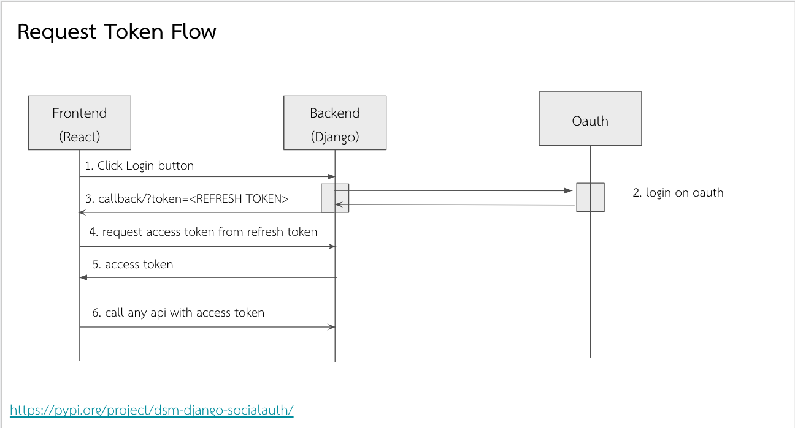

# mpt-django-oauth

Requirements
============
- python >= 3.8
- django >= 3.0
- social-auth-app-django
- djangorestframework-simplejwt

Installation
============
```
pip install mpt-django-oauth
```

Usage
=====
### Prerequisite

- must be ```PROTOCOL://HOST/oauth/complete/mptauth/```
> note: Callback URL must be same with decarelation in urls.py
> 
> in this example use http://127.0.0.1/oauth/complete/mptauth/

### in setting.py 
```python
INSTALLED_APPS = [
    'mptauth', # must be top of installed app
    ...
    'social_django',
    'rest_framework', # optional for use /authen/api/account/me/
    ...
]
```
add authentication backend in setting.py
```python
AUTHENTICATION_BACKENDS = [
    ...
    'django.contrib.auth.backends.ModelBackend',
    'mptauth.backend.mptOAuth2',
    ...
]
```
set client id and client secret in setting.py
```python
SOCIAL_AUTH_MPTAUTH_KEY = '<client_id>'
SOCIAL_AUTH_MPTAUTH_SECRET = '<client_secret>'
```

Sample SOCIAL_AUTH_PIPELINE
```python
SOCIAL_AUTH_PIPELINE = [ 
    'social_core.pipeline.social_auth.social_details',
    'social_core.pipeline.social_auth.social_uid',
    'social_core.pipeline.social_auth.social_user',
    'social_core.pipeline.user.get_username',
    'social_core.pipeline.user.create_user',
    'social_core.pipeline.social_auth.associate_user',
    'social_core.pipeline.social_auth.load_extra_data',
    'social_core.pipeline.user.user_details',
    'social_core.pipeline.social_auth.associate_by_email',
]
```
Add login redirect
```python
LOGIN_REDIRECT_URL='<path to redirect>'
```
Setauth server name and url
```python
OAUTH_MPT_SERVER_BASEURL = 'oauth.data.storemesh.com'
BASE_BACKEND_URL = '<backend domain> eg http://localhost:8000'
```
(optional) If use in internal ip address for MPT VMs
```python
OAUTH_MPT_SCHEME = "<http or https>"
OAUTH_INTERNAL_IP = "<internal oauth provider ip address>"

SOCIAL_AUTH_VERIFY_SSL = "true/false"
```

add setting authen via simple jwt
```python
REST_FRAMEWORK = {
    'DEFAULT_AUTHENTICATION_CLASSES': [
        'rest_framework_simplejwt.authentication.JWTAuthentication',
        'rest_framework.authentication.SessionAuthentication',
        'rest_framework.authentication.BasicAuthentication',
    ],
}

from datetime import timedelta
SIMPLE_JWT = {
    'ACCESS_TOKEN_LIFETIME': timedelta(hours=1),
    'REFRESH_TOKEN_LIFETIME': timedelta(days=1),
    'ROTATE_REFRESH_TOKENS': False,
    'BLACKLIST_AFTER_ROTATION': True,

    'ALGORITHM': 'HS256',
    'SIGNING_KEY': SECRET_KEY,
    'VERIFYING_KEY': None,
    'AUDIENCE': None,
    'ISSUER': None,

    'AUTH_HEADER_TYPES': ('Bearer',),
    'USER_ID_FIELD': 'id',
    'USER_ID_CLAIM': 'user_id',

    'UPDATE_LAST_LOGIN':True
}
```
> See more detail about **social-app-django** in (https://github.com/python-social-auth/social-app-django)

### in urls.py
```python
from django.urls import path, include
from mptauth.complete import complete

urlpatterns = [
    ...
    path('oauth/complete/<str:backend>/', complete, name='complete'),
    path('oauth/', include('social_django.urls', namespace='social')),
    path('authen/', include('mptauth.urls'))

    ...
]
```

### in template
- template
```html
    ...
        <a href="">Login with MPT</a>
        <a href=""> LOGOUT</a>
    ...
```
- signin with next
```html
    ...
    <a 
        href="?next={{ request.scheme }}://{{ request.get_host }}"
    >
        Login with mpt
    </a> 
    ...
```

# If use backend-frontend (Client Site Render)
can use authentication with JWT

### in settings.py
```python
BASE_FRONTEND_URL='http://localhost:3000/'
```

## Authentication step



1. frontend href to ```<BACKEND_URL>/oauth/login/mptauth```
    - optional ```<BACKEND_URL>/oauth/login/mptauth/?callback=<FRONTEND_URI>```
        - FRONTEND_URI : domain frontend or localhost:xxxx
        - default: use in backend settings ```BASE_FRONTEND_URL``` and ```BASE_BACKEND_URL```
2. backend authentication with oauth server
3. if authen complete backend callback to frontend ```<BASE_FRONTEND_URL>/callback?token=<REFRESH_TOKEN>```
 - note BASE_FRONTEND_URL in backend/settings.py previous step
4. frontend request access token with refresh token via 
    - request

    ```
    [POST] : <BACKEND_URL>/authen/token/refresh/
    body : {
        "refresh" : "<REFRESH_TOKEN IN STEP 3>"
    }
    ```
    - reponse
    ```
    {
        "access": "eyJ0eXAiOiJKV1Qi...ifZOpwg"
    }
    ```
5. frontend collect access(access token) for request api

## How to use
- request to backend
```
URL : <BACKEND>/api/xxx
HEADER : {
    'Authorization': "Bearer <ACCESS_TOKEN>"
}
```

## logout / sign out

- logout href to ```<BACKEND_URL>/authen/logout/```
    - optional ```<BACKEND_URL>/authen/logout/?callback=<FRONTEND_URI>```
        - FRONTEND_URI : domain frontend or localhost:xxxx
        - default: use in backend settings ```BASE_FRONTEND_URL``` and ```BASE_BACKEND_URL```

## Optional setup log 
### log header
add settings in `settings.py`
```python
MIDDLEWARE = [
    ...
    'mptauth.middleware.LogHeaderMiddleware',
    ...
]
```

it's can get log in response header
- X-Username : (string) username ex `mike`
- X-Error : (string) short traceback python exception ex 
    ```
    File /backend/searchapp/views.py, line 6, in error
    i = 10/0
    ZeroDivisionError: division by zero
    ```
### log database
```python
MIDDLEWARE = [
    ...
    
    'mptauth.middleware.RequestLoggingMiddleware'
]
```
- if have exclude paths
```py
ACCESS_LOOGING_EXCLUDE_PATHS = [
    r'.*status.*'
]
```

## Optional use JWT middleware
```python
MIDDLEWARE = [
    ...
    'mptauth.middleware.JWTauthenticationMiddleware',
    ...
]
```
if pass jwt token in header can use `request.user`

# SignIn Admin via Oauth
-  edit `urls.py`
```python
...
admin.site.login_template = 'admin/custom-login.html'
admin.site.index_template = 'admin/custom-index.html'
admin.site.site_title = "<PROJECT NAME>"
admin.site.site_header = "<PROJECT NAME>"
...
```

# Get user info
`[GET]: <BASE_URI>/authen/api/account/me/`
```json
{
    "id": 1,
    "user": "system_admin",
    "is_staff": true,
    "is_superuser": true,
    "first_name": "system",
    "last_name": "admin",
    "email": "system_admin@email.com",
    "image": null,
    "role": [
        {
            "name": "DataUser"
        },
        {
            "name": "SystemAdmin"
        }
    ],
    "permission": [
        3,
        7
    ]
}
```

## For Developer 
- `.env`
```conf
MPT_AUTH_KEY=''
MPT_AUTH_SECRET=''
MPT_AUTH_BASEURL=''
MPT_AUTH_SCHEME=''
MPT_AUTH_INTERNAL_IP=''
```

- `settings.py`
```py
SOCIAL_AUTH_MPTAUTH_KEY = os.environ.get('MPT_AUTH_KEY')
SOCIAL_AUTH_MPTAUTH_SECRET = os.environ.get('MPT_AUTH_SECRET')
OAUTH_MPT_SERVER_BASEURL = os.environ.get('MPT_AUTH_BASEURL')
OAUTH_MPT_SCHEME = os.environ.get('MPT_AUTH_SCHEME')
OAUTH_INTERNAL_IP = os.environ.get('MPT_AUTH_INTERNAL_IP')
SOCIAL_AUTH_VERIFY_SSL = os.environ.get('SOCIAL_AUTH_VERIFY_SSL' , 'false').lower() == 'true'
```